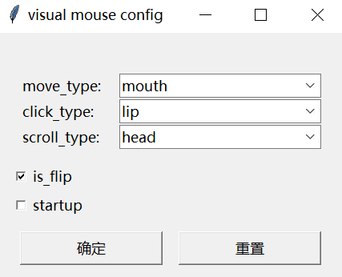

建议配合B站的介绍视频食用：https://www.bilibili.com/video/BV1ZHieYpEJR/
# 使用教程
## 显式参数

程序提供了五个可调整参数，分别为
##### move_type 鼠标移动的方法
position：使用头部倾角直接控制鼠标的位置
mouth：使用嘴唇移动控制鼠标移动
##### click_type 鼠标点击的方法
lip：短时间张嘴代表左键，长时间张嘴代表右键
eye：闭合左眼代表按左键，闭合右眼代表按右键
##### scroll_type 滚轮的使用的方法
head：抬头向上滚动，低头向下滚动
lip：嘴唇左撇向上滚动，右撇向下滚动
##### is_flip 图像左右翻转
勾选则翻转摄像头画面，如果你发现画面左右对调了，可以调整这个选项
##### startup 开机启动
勾上会在开机时自动启动本程序

**修改选项后，点击确定按钮生效**
### 推荐使用组合1：
**move_type**:mouth

**click_type**:lip

**scroll_type**:head

### 推荐使用组合2：
**move_type**:position

**click_type**:lip

**scroll_type**:lip

## 隐藏参数
除了上述放在ui上的参数，还有一些参数在conf.ini中
##### starget_frame_rate
鼠标移动的刷新率，一般与显示器刷新率对其即可，默认值60
##### smove_speed
鼠标移动速度，像素每秒，默认值500，增大这个值可以加快鼠标运动速度
##### horizontal_max
默认值8，代表当头部左右移动8度的时候，鼠标移动到屏幕最左边或者最右边
##### vertical_max
默认值5，代表当头部上下移动5度的时候，鼠标移动到屏幕最上边或者最下边
##### lip_direction
嘴唇左右撇的阈值，越小，嘴唇左右撇检测精度越高，默认值8
##### safe_border
因为鼠标贴到屏幕边缘很难找到，所以设定一个鼠标离屏幕边缘最近的距离，默认10像素
##### left_click_threshold
默认值5帧，张嘴唇到闭嘴唇之间间隔5帧以上，则认为是一次点击左键
##### right_click_threshold
默认值30帧，张嘴唇到闭嘴唇之间间隔5帧以上，则认为是一次点击右键
##### big_mouth
嘟嘴检测阈值，该值意义是：上下嘴唇的距离/嘴唇左右横向长度
默认值1，**减小**这个值会**增加**嘟嘴检测的灵敏度
##### small_mouth
扁嘴检测阈值，默认值0.3，**增大**这个值会**增加**扁嘴检测的灵敏度（没有写错
##### resolution_w resolution_h
相机采集分辨率，默认值640*480，通常不需要修改，如果发现卡顿，可酌情降低

未提及的参数代表没用到，可以忽略